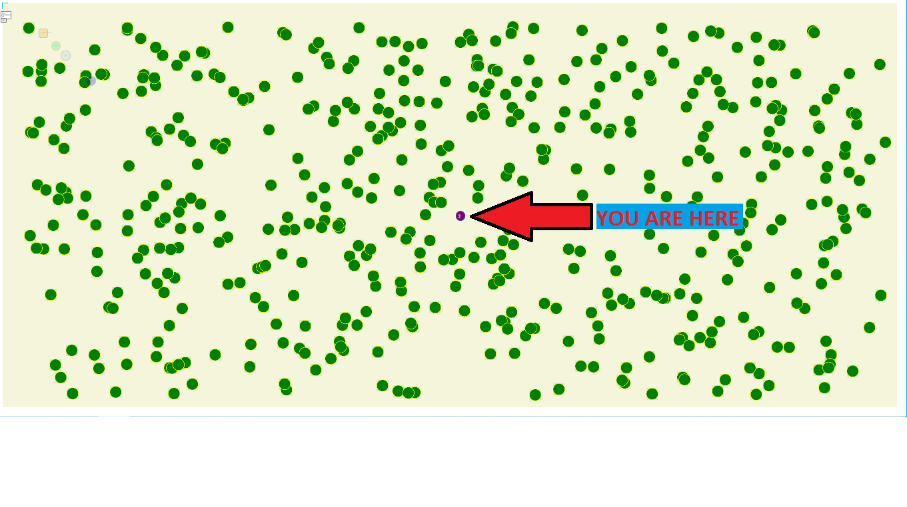
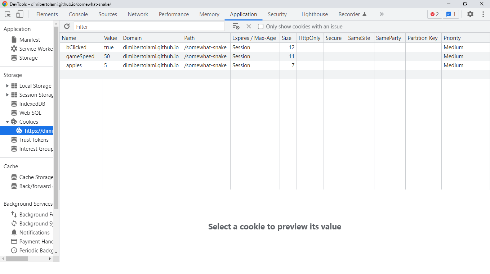

# somewhat-snake
not quite like the classic snake game
a bit of pacman in there too

i have now four ghosts chasing you shouting stuff to you. they speed up and slow down at (for now) fixed intervals
the game over logic is working for now.I still want to overlay a big "GAME OVER" banner over the canvas.. hasn't happened yet so for now a simple popup will do
the ghosts are regenerated but are for some reason dead when I spawn them.. need to look into why that's happening.
the game is now using cookies to store the gamespeed and the amount of apples it will each time spawn randomly. Both of which the player can now set and will be remembered throughout each refresh. the update cookie button also functions as a reload game button (the only thing I haven't solved with cookies yet is the create new cookie prompt will always happen each reload.. which is only needed if you decide to delete a key/value pair from the game cookies like i did myself. which without the prompt will kill the game in your browser)

## One does not "simply" use code from Yasser...
I FINALLY think I figured out Yasser's code contribution with his 4k screen resolution.. the game was probably patheticly small on his screen so he adapted my code to work on his screen. I think I can finally say I am now using his code correctly so that the screen can be resised, and the apples will allways be spawned inside the complete canvas without spawning at an 'untouchable location'

## a bit about the input text fields, the cookie prompt and the button

the button click sets the values in the input fields.
then the page reloads so you get the cookie prompt. 
if you changed the amount of apples you click cancel on the prompt otherwise the new settings are immediately overwritten.
you can also view or change the content of the cookie key/value pair in your developer tools:

update: now in the cookie store you find a boolean cookie bClicked=false
set this to true if you don't want the annoying cookie prompt each reload.. hard refreshing the page (CTRL+F5 on windows) sets it back to false.. Now  you can reset the game by clicking the button without the cookie prompt!

